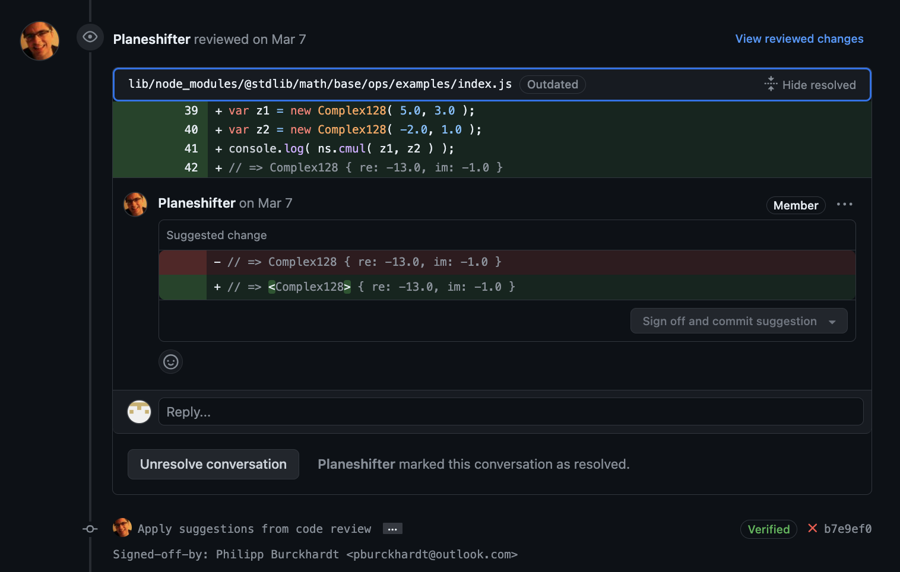

### Project: stdlib-js
- Project: [stdlib-js](https://github.com/stdlib-js)
stdlib-js is a standard library for JavaScript and Node.js. It mainly provides numerical and scientific functionality, with robust performance. 

### My Contributions
- [Merged PR: Improve documentation for `math/base/ops` namespace](https://github.com/stdlib-js/stdlib/pull/1722)
This documentation was user-facing. It was meant for users of the software to get a good understanding of what this package of the library provides and any interesting usage examples. While working on this 

### My Learning Record
The codebase was very well documented, with very clear-cut instructions of how to set up the library, the standard practices for developers (including testing documentation and code quality expectations). 

- make: make was used for this project, not only to build executables but also to install dependencies, initialise git hooks, etc.
- "Sign off and commit suggestion" (cool! allow devs to merge in code directly from ): 
    For very simple and small changes required, we can create a hook that can apply changes / suggestions from reviewers.
    Although we do hope for new contributors to get this chance to learn about teammates' coding practices, in other instances and for minor nits: it can significantly speed up time taken to merge in PRs if the author does not need to manually make the changes in their branch and push again.
    
- very well-structured pipelines and application structure (easy to set up, test, lint, etc; clear and concise documentation)