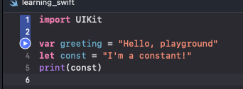

### Project: Scribe iOS

[Scribe](https://github.com/scribe-org/Scribe-iOS) is a pack of iOS keyboards for language learners. It supports languages such as German, French, Italian etc.
It supports features such as language translation to language of choice, singular to plural conversion and word suggestions.
Data is sourced from the [Wikidata](https://www.wikidata.org/wiki/Wikidata:Main_Page) knowledge base.

Similar to TEAMMATES, Scribe has also been part of GSoc in 2023 and part of the Wikimedia community (which Wikipedia is a part of).

### My Contributions

[Code quality improvements for Swift code](https://github.com/scribe-org/Scribe-iOS/pull/395)
I contributed by first going through open issues and managed to find some code improvement suggestions made. Then, I performed some code refactoring of the codebase to improve code quality.

### My Learning Record

For tools learnt, as I am new to Swift/iOS/mobile programming, I learnt to set up the development environment needed which was new to me. This involves installing Xcode and setting up the emulator for verification of correctness.

Resources used:
- [Xcode setup](https://developer.apple.com/documentation/safari-developer-tools/installing-xcode-and-simulators)
- [Using various simulators to verify iOS works on iPad and iPhone](https://developer.apple.com/documentation/xcode/running-your-app-in-simulator-or-on-a-device)

This idea of simulators is new to me but reminiscent of the DevTools in web browsers such as Chrome.
Interestingly, the simulators also provide a similar interface as browser devtools which allow developers to debug code.

I also spent time learning a new programming language for my contribution, Swift, which introduces some new syntax not present in other programming languages like Java.

For example, instead of:
```
for (int i = 0; i < 3; i++) {
    ...
}
```
in Java. Swift introduces range operators
```
a..<b (includes value a, but excludes the value b) and a...b
a...b (includes both a and b)
```
This syntax is especially convenient as it allows us to do:
```
case 0..<3:
    print("Value within 0 and 2 inclusive)
case 4...5:
    ...
```
which is not possible with Java or C.

Resource:
[Hacking With Swift Tutorial, range operators](https://www.hackingwithswift.com/sixty/3/9/range-operators)

An interesting observation is that compared to other programming languages, Apple seems to invest heavily in its developer education community and tries to make learning Swift as fun as possible.

I experimented with the [Swift Playgrounds](https://developer.apple.com/swift-playgrounds/), a gamified application by Apple to learn Swift as part of my learning journey to work on a Swift codebase.
It allows one to learn Swift fundamentals through completing objectives through a game.


Apple has also made learning Swift a more intuitive experience by introducing a code evaluator in the playground environment directly which makes understanding Swift code a lot easier in the Xcode IDE.

As part of implementing code improvements, I also researched Swift conventions. I learnt that camelCase is the default convention used in Swift.

### OSS practices from Scribe-iOS:
1. Usage of public chat room

Since OSS projects usually accept contributions from developers from all over the world, Scribe uses an [Matrix community chatroom](https://app.element.io/#/room/#ScribeiOS:matrix.org) to build a community and for all developers to join. This chatroom allows developers to introduce themselves, discuss issues related to development, raise suggestions and ask for help. This is a practice TEAMMATES might be able to adopt.

2. Github actions automation for maintainer checklist

After each PR is made, an automated message encouraging contributors to join the abovementioned chat room and a bunch of checklist items are posted. This serves as a communication tool to new developers and serves as a friendly introduction to new committers which builds a more welcoming community.

3. Changelog
Before changes are made, the [CHANGELOG](https://github.com/scribe-org/Scribe-iOS/blob/main/CHANGELOG.md) has to be updated with a description of the changes made. This allows releases to be documented and allows developers to keep track of what each version entails.
